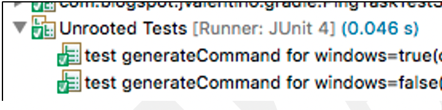

## 4.6 The Command-Line

When dealing with automating tests, builds, and deployment, I have found that command-line interaction is inevitable. Whether having to run some third-party testing tool that doesn’t have an existing Gradle plugin, to having to make your own method for transfer a jar file from the Jenkins server to target server, the command-line often become the only option for automation. In a perfect world we would just use some existing tool and/or plugin, but that is not always an option for most of us.

This example demonstrates how to execute the **ping** command on both Windows and Linux, then process the output. This executing also provides a best-practices for generating commands in cross-platform environments, as well as how to handle mocking during unit testing.

 

#### Windows Ping

```bash
Pinging www.google.com [74.125.224.82] with 1500 bytes of data:
Reply from 74.125.224.82: bytes=1500 time=68ms TTL=52
Reply from 74.125.224.82: bytes=1500 time=68ms TTL=52
Reply from 74.125.224.82: bytes=1500 time=65ms TTL=52
Ping statistics for 74.125.224.82:
   Packets: Sent = 5, Received = 5, Lost = 0 (0% loss),
Approximate round trip times in milli-seconds:
   Minimum = 65ms, Maximum = 70ms, Average = 67ms

```

This is the output of the ping command on Windows.

 

#### Linux Ping

```bash
PING google.com (172.217.4.46): 56 data bytes
64 bytes from 172.217.4.46: icmp_seq=0 ttl=50 time=59.057 ms
64 bytes from 172.217.4.46: icmp_seq=1 ttl=50 time=50.334 ms
64 bytes from 172.217.4.46: icmp_seq=2 ttl=50 time=45.259 ms
64 bytes from 172.217.4.46: icmp_seq=3 ttl=50 time=44.930 ms

--- google.com ping statistics ---
4 packets transmitted, 4 packets received, 0.0% packet loss
round-trip min/avg/max/stddev = 44.930/49.895/59.057/5.707 ms

```

This is the output of the ping command on Linux.

#### src/main/groovy/com/blogspot/jvalenitno/gradle/CommandLinePlugin.groovy

```groovy
class CommandLinePlugin implements Plugin<Project> {
    void apply(Project project) {
        project.task('ping', type:PingTask)
    }
}

```

The only function of the plugin class, is to associate the “ping” keyword with the **PingTask** class.

 

#### src/main/groovy/com/blogspot/jvalenitno/gradle/PingTask.groovy

```groovy
class PingTask extends DefaultTask {

    static final String PING = 'ping'
    protected PingTask instance = this

    @TaskAction
    void perform() {
        boolean isWindows = OsUtil.isWindows()

        List<String> commands = instance.generateCommand(
                isWindows, instance.project.properties['host'])

        String output = instance.executeCommand(commands)

        List<Double> times = instance.parsePingOutput(
                isWindows, output)

        println times
    }

```

The stragegy used in the construction of this class, was to separate it out into the following parts (as methods), to make testing it easier:

·   Operating System determination

·   Generating the platform specific ping command

·   Running the platform specific command

·   Processing the output of command

 

In this case, the technique of using the **instance** member variable for “this” so that it can be replaced by a mock for unit testing, is used to more easily test individual methods. If I were not using mocking within the **perform()** method, a single test case would become quite lengthy due to all of the mocking that is involved in the methods that it calls. Another option is to breakout this logic into another class entirely, which was done with **OsUtil** for different reasons, but this class was already pretty small.

 

**Line 18: is this Windows?**

The mechanism used for determining the Operating System comes from an internal Gradle class called **OperatingSystem**. The encountered issue when using this class is when it comes to testing, as the **OperatingSystem** class cannot be mocked. The strategy used for dealing with this, was to wrap the call its own class, in this case **OsUtil**, which can then be mocked.

 

**Lines 20-21: Getting the commands**

The instance member variable technique is used for obtaining the **Project** reference, as its properties cannot be modified on the default object.

 

**Lines 31-49: Generating the commands**

```groovy
   List<String> generateCommand(boolean isWindows, String host) {
        List<String> commands = []
        String pingCount = '4'

        if (isWindows) {
            commands.add('cmd')
            commands.add('/c')
            commands.add(PING)
            commands.add('-n')
        } else {
            commands.add(PING)
            commands.add('-c')
        }

        commands.add(pingCount)
        commands.add(host)

        commands
    }

```

A strategy that can be used to is take a command and break it up into its parts, separated by space. The Gradle command-line executor will handle putting the spaces back in. The advantage of this method is that it allows the easier handling of indiviudal parameters within a command-line call.

​      The Windows command-line will require “cmd /c” prior to any command, while Linux can be different depends on the command. Generally “sh -c” is used for executing scripts, while “-c” is used for executing commands. Sometimes exeprimentaiton is required.

 

**Lines 51-60: Command execution**

```groovy
    String executeCommand(List<String> commands) {
        ByteArrayOutputStream stdout = new ByteArrayOutputStream()

        instance.project.exec {
            commandLine commands
            standardOutput = stdout
        }

        stdout.toString()
    }

```

Command execution is handled via Project.exec, but done so through the **instance** member variable instead of “this”. The reason is that anything other that the mock instance will actually try and run the command, which is what we don’t want. This is because we want to test both Windows and Linux, without having to run the tests on two differnet Operating Systems.

​      The ByteArrayOutputStream is passed into the command-line execution, to collect all of the command-line output. Note that this can also be done for standard error if so desired. The result is converted into string form, which includes any carriage returns.

 

**Lines 62-92: Processing the output**

```groovy
    List<Double> parsePingOutput(boolean isWindows, String output) {
        String whitespace = '\\s+'
        String pingSplit = '='

        List<Double> results = []
        if (isWindows) {
            output.eachLine { String line ->
                String[] split = line.trim().split(whitespace)

                if (split.first().startsWith('Reply')) {
                    String timeString =
                            split[4].split(pingSplit).last()
                    timeString = timeString[0..-3]
                    double time = Double.parseDouble(timeString)
                    results.add(time)
                }
            }
        } else {
            output.eachLine { String line ->
                String[] split = line.trim().split(whitespace)

                if (split.length == 8) {
                    double time = Double.parseDouble(
                            split[6].split(pingSplit).last())
                    results.add(time)
                }
            }
        }

        results
    }

```

The purpose of this code is to handle getting the response times from the command-line output, which depends on whether this output was from Windows or not.

#### src/main/groovy/com/blogspot/jvalenitno/gradle/OsUtil.groovy

```groovy
package com.blogspot.jvalentino.gradle

import org.gradle.internal.os.OperatingSystem

/**
 * Since I can't figure out how to mock OperatingSystem, 
 * I threw it in this class
 * so at least the wrapping class can be mocked
 * @author jvalentino2
 *
 */
class OsUtil {

    static boolean isWindows() {
        OperatingSystem.current().isWindows()
    }
}

```

While there a several ways to determine the operating system of the running application, the preference in the Gradle space is to use its **OperatingSystem** class. The issue with this implementation though, is the inability to mock it using **GroovyMock**. Doing so will result in a runtime error, so another way dealing with it is required.

​      A common technique for dealing with difficult to test and/or mock interactions, is to wrap them in something that can be easily handled. For the purpose of this wrapper, a static method was used to that the containing class can be mocked using **GroovyMock()**. Another options would be to use a non-static method, and mock the instance using **Mock**().

 

#### src/test/groovy/com/blogspot/jvalenitno/gradle/PingTaskTestSpec.groovy

```groovy
class PingTaskTestSpec extends Specification {
    @Subject
    PingTask task
    Project project
    
    def setup() {
        Project p = ProjectBuilder.builder().build()
        task = p.task('ping', type: PingTask)
        task.instance = Mock(PingTask)
        project = Mock(ProjectInternal)
        GroovyMock(OsUtil, global:true)
    }

```

**Lines 15-17: Standard members**

The task and the project will be needed in most every test case, so it is best to keep them as member variables.

 

**Lines 20-23: Standard setup**

The task must be instantiated via the **Project** instance, which itself must be constructed using the **ProjectBuilder** fixture. To deal with both mocking **project.properties** and calls to the other complicated methods, the technique for replacing the **instance** member variable with a mock is used.

 

**Line 24: OsUtil**

The purpose of this line is to globally replace all occurrences of **OsUtil** with a mock.

 

##### Asserting General Flow

Since this test is relying on mocks to calls within the same class, this is testing general flow, and not integration. We will be relying on other unit tests to ensure the function of the other involved methods. It is also recommended to separately integration test the flow my removing the internal mocks, which additionally requires substantial mocking beyond the scope of the unit testing focus.

```groovy
    void "unit test perform"() {
        given:
        
        List<String> commands = ['a', 'b']
        Map properties = ['host':'foo.com']
        
        when:
        task.perform()
        
        then:
        1 * OsUtil.isWindows() >> true
        1 * task.instance.project >> project
        1 * project.properties >> properties
        1 * task.instance.generateCommand(true, 'foo.com') >> commands
        1 * task.instance.executeCommand(commands) >> 'output'
        1 * task.instance.parsePingOutput(true, 'output') >> [32.43]
    }

```

**Lines 30-31: Given**

The command list represents a generic list of parameter to be returned as the mocked result for when **task.instance.generateCommand** is called. The properties map represented what is returned, specifically the host value, when **project.properties** is called.

 

**Line 37: We are Windows**

When one call is made to **OsUtil.isWindows(),** where **OSUtil** was replaced with a mock, return true.

 

**Line 38: Mocking the project**

When one call is made to **task.instance.project**, where instance is a mock of the custom task class, return the **project** mock that was configured in the **setup** method.

 

**Line 39: Mock the properties**

When one call is made to **project.properties**, where **project** is a mock that was configured in the **setup** method, return the **properties** Map that was defined in the **given** clause.

 

**Line 40: generateCommand**

When one call is made to **task.instance.generateCommand**, where **instance** is a mock of the task class, with the parameters of true (meaning it is windows) and the host of “foo.com”, return the list of commands. The purpose is to ensure that first integration of the **perform** method is with the **generateCommand** method, and that it takes the parameters that represent if this is Windows, followed by the hostname.

 

**Line 41: executeCommand**

When one call is made to **task.instance.executeCommand**, where **instance** is a mock of the task class, with the parameter of the commands list from the previous line, return the value of “output.” The purpose is to ensure that the second integration of the **perform** method is with the **executeCommand** method, which takes the list of commands as an input.

 

**Line 42: parsePingOutput**

When one call is made to **task.instance.parsePingOutput**, where **instance** is a mock of the task class, with the parameters of true (meaning it is windows) and the output from the previous line, return a list of Doubles. The purpose is to ensure that the third integration of the **perform** method is with the **parsePingOutput** method, which takes the parameters that represent this is Windows, followed by the output from the previous line.

 

##### Testing generateCommand

The purpose of this test is to assert the behavior of the **generateCommand** method, which has different output depending on whether it is Windows or not.

```groovy
    @Unroll
    void "test generateCommand for windows=#isWindows"() {
        given:
        String host = "foo.com"
        
        when:
        List<String> commands = task.generateCommand(isWindows, host)
        
        then:
        commands.toString() == result
        
        where:
        isWindows   || result
        true        || '[cmd, /c, ping, -n, 4, foo.com]'
        false       || '[ping, -c, 4, foo.com]'
    }

```

**Line 45: Unrolling**

The annotation @Unroll is a Spock feature that treats each test set from the **where** clause, and lists it as an independent test execution:



It additionally allows the use of parameters from the first row of the **where** clause, prefixed by “#” in the test method name. This makes it easier to debug length test cases, such as if there 19 passes with 1 failure, it is easy to tell exactly which line failed.

 

**Line 51: Multiple when executions**

In a Spock test method, the **where** clause will result in an independent execution of the **when** clause for every set of inputs in the **where** clause. The **isWindows** parameter isn’t defined in the **given** clause, as it is now defined in the **where** clause. Each value in the **isWindows** column represents a different value that will be used for executing **task.generateCommand** in the **when** clause.

 

**Line 54: Then**

Just like with the **when** clause, variable substitution can be used with the columns defined in the **where** clause. This expression assets that the command list must equal the corresponding row from the **result** column.

 

**Lines 56: The where clause**

The purpose of the **where** clause is to run the **when** clause for every set of values. This is opposed to copying and pasting similar individual test cases or having to write generic test functionality. The **where** clause is representative of a “truth table” and is intended to more easily express input and output variability in human readable form.

 

**Line 58: Windows**

The line specifies that when **isWindows** is true, the expected result is a ping command that will work on Windows.

 

**Line 59: Not Windows**

The line specifies that when **isWindows** is false, the expected result is a ping command that will work on Linux.

 

##### Testing executeCommand

The purpose of this test is to assert the behavior of the **executeCommand** method, which is a wrapper around **project.exec** for accessing the command-line.

```groovy
void "test executeCommand"() {
        given:
        GroovyMock(ByteArrayOutputStream, global:true)
        ByteArrayOutputStream os = Mock(ByteArrayOutputStream)
        List<String> commands = ['a', 'b']
        
        when:
        String output = task.executeCommand(commands)
        
        then:
        1 * task.instance.project >> project
        1 * project.exec(_)
        1 * new ByteArrayOutputStream() >> os
        1 * os.toString() >> 'output'
        
        and:
        output == 'output'
    }

```

**Lines 64-65: ByteArrayOutputStream**

This method under test instantiates a **ByteArrayOutputStream** for the purpose of capturing standard output from the command-line. Since we are relying on a mock **project** to accept a call to **exec**, it is easiest to mock the interaction with the **ByteArrayOutputStream** as well. 

 

**Line 66: Commands**

Since we are mocking both the input and the output to **project.exec**, the commands are actually not relevant. Any value here will have the same result.

 

**Line 72: Project**

The **Project** must be mocked in order to appropriately handle the exec method. If the instance comes from the **ProjectBuiler** fixture, it will attempt to actually invoke the command at the command-line.

 

**Line 73: project.exec**

Expects one call to **project.exec**, with any parameters.

 

**Line 74-75: Mocking standard out**

The global mock allows us to return our mock instance of **ByteArrayOutputStream** when it is instantiated. The mock of standard out returns “output” when it is converted to String, which becomes the return of the method.

 

##### Testing parsing the ping output

Instead of copying and pasting the output of the ping commands from both Windows and Linux into a String, the output was places in files under src/test/resources.

```groovy
    void "Test parsePingOutput for not windows"() {
        given:
        String output = 
            new File('src/test/resources/ping-linux.txt').text
        
        when:
        List<Double> results = task.parsePingOutput(false, output)
        
        then:
        results.toString() == '[59.057, 50.334, 45.259, 44.93]'
    }
    
    void "Test parsePingOutput for windows"() {
        given:
        String output = 
            new File('src/test/resources/ping-windows.txt').text
        
        when:
        List<Double> results = task.parsePingOutput(true, output)
        
        then:
        results.toString() == '[68.0, 68.0, 65.0]'
    }

```

 

Both test cases verify that the appropriate output can be successfully parsed between Windows and Linux.


